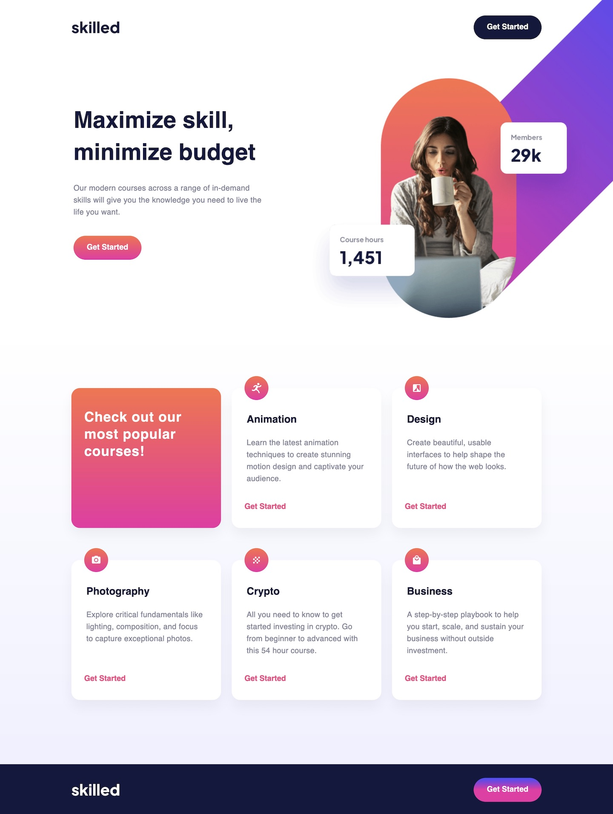

# **Skilled e-learning landing page solution**

This is a solution to the [Skilled e-learning landing page challenge on Frontend Mentor](https://www.frontendmentor.io/challenges/skilled-elearning-landing-page-S1ObDrZ8q).

## **Table of contents**

- [Screenshot](#screenshot)
- [Links](#links)
- [Built with](#built-with)
- [What I learned](#what-i-learned)
- [Continued development](#continued-development)
- [Author](#author)

## **Screenshot**

## **Links**

- [Solution URL](https://github.com/ionStici/skilled-elearning-landing-page)
- [Live Site URL](https://ionstici.github.io/skilled-elearning-landing-page)

## **Built with**

- Semantic HTML5 markup
- CSS3
- Flexbox
- CSS Grid
- Responsive Images
- Media queries

## **What I learned**

That CSS can be complex.

## **Continued development**

Clearly i should review the topic about responsive images.

## **Author**

- GitHub - [@ionStici](https://github.com/ionStici)
- Frontend Mentor - [@ionStici](https://www.frontendmentor.io/profile/ionStici)
- Twitter - [@IonStici3](https://twitter.com/IonStici3)
